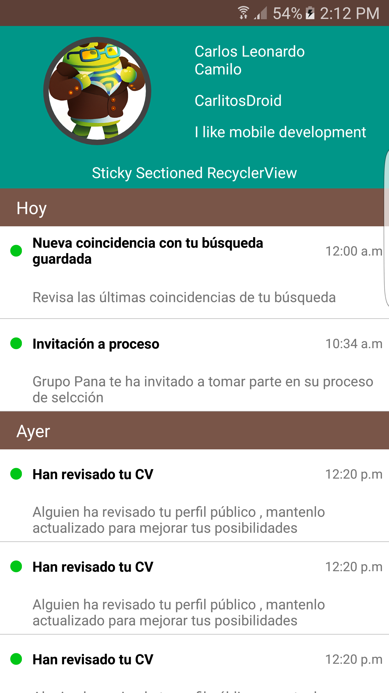
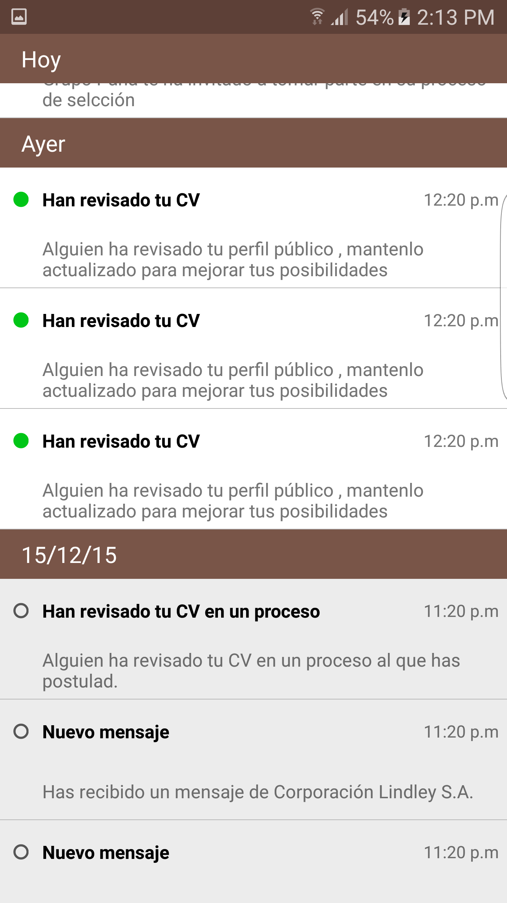

# Android Sticky Sectioned RecyclerView 

In this sample I woud like to show you the most powerful of the recyclerview in Android, I hope it helps you , don't forget your Star :3.

#ScreenShots

  

  

#Support

Min SDK
14 (Android 4.0–4.0.2 Ice Cream Sandwich)
Target SDK
23 (Android 6.0 Marshmallow)

#About me

A student in Lima Perú. 
If you have any new idea about this project, feel free to [contact me](carlitosdrodi12@gmail.com).

